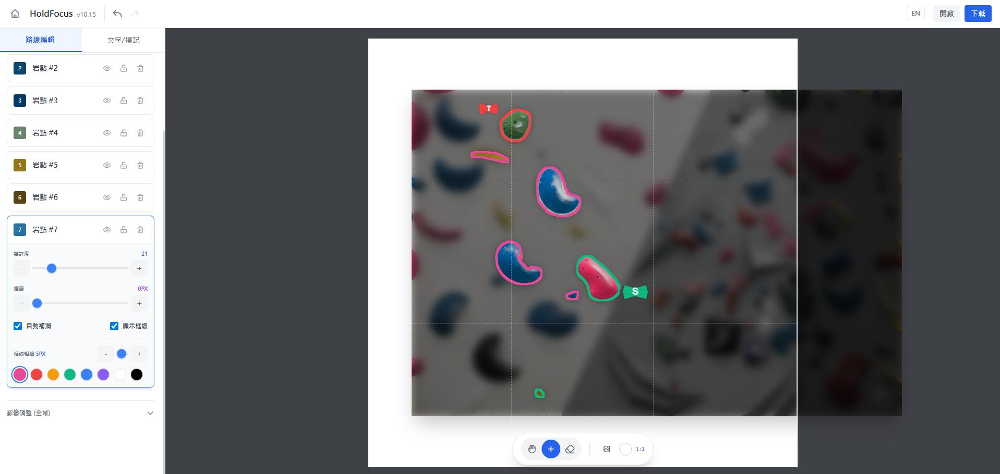

# Project Core: Climbing Toolbox

A web-based auxiliary toolbox for climbers, developed with AI assistance and deployed via GitHub Pages. The project aims to evolve into a comprehensive training management platform.

---

## 1. Initial Feature: Route Editor (HoldFocus Canvas)
The primary module designed to streamline route creation and sharing for both climbers and gym setters.

* **Smart Mask Selection**: Combines **Lasso Paths** and **Color Difference Algorithms** to precisely highlight climbing holds on image overlays.

## 2. Future Development: Cloud
* **Cloud Socialization**: **Firebase** integration for user accounts, enabling cloud-based route albums and one-click sharing.

## 3. Features in Queue (Backlog)

### Training Tools & AI Analysis
* **Hangboard Training Timer**: Specialized timer for hangboard and bouldering sessions.
    * **Hardware Integration**: Supports **WeiHeng C06 Bluetooth Crane Scale** for automated finger strength data logging.
* **Image Analysis Evolution**:
    * **Motion Tracking**: Transitioning from static marking to video analysis to automatically track climbing trajectories.
    * **Pose Estimation**: Utilizing AI to analyze center-of-gravity shifts and movement precision for technical feedback.

### Gear & Database
* **Gear Database**: A comprehensive database for climbing shoe specifications and performance comparisons.

# 專案核心：攀岩工具箱

這是一個為攀岩者設計的網頁輔助工具箱，透過人工智慧輔助開發並部署於 GitHub 頁面。目標是從基礎工具演進為全方位的攀岩訓練管理平台。

---

## 一、 現有核心功能：路線編輯器

作為專案的首個模組，旨在簡化岩館與攀岩者紀錄、分享路線的流程。

* **智能選區**：結合套索路徑與色差演算法，精準標記並突出顯示岩牆上的岩點。

## 二、 未來發展：雲端化

* **社交雲端化**：整合雲端用戶系統，支援個人雲端相簿與一鍵分享功能。

## 三、 待開發清單

### 訓練輔助與人工智慧分析
* **指力板訓練計時器**：專為指力板與抱石課表設計。
    * **硬體整合**：支援藍牙吊秤接入，自動記錄指力測試數據。
* **影像分析演進**：
    * **動作追蹤**：從靜態標記轉向影片分析，自動捕捉攀爬軌跡。
    * **姿勢評估**：利用人工智慧分析重心偏移與動作精準度，提供技術性回饋。

### 裝備庫
* **岩鞋資料庫**：收錄各品牌岩鞋規格，提供性能對比與選購參考。
